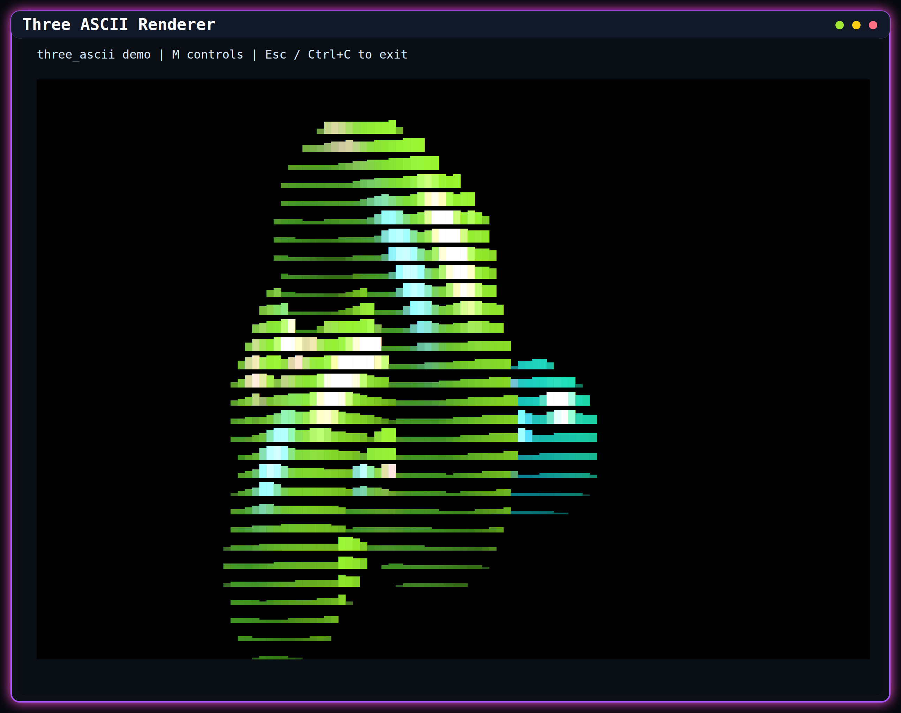
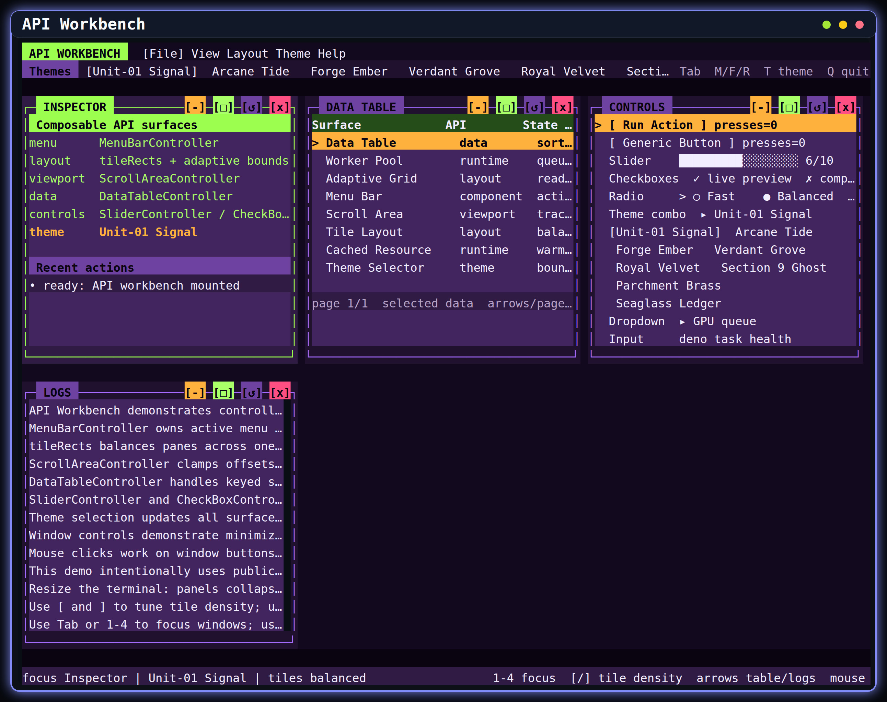
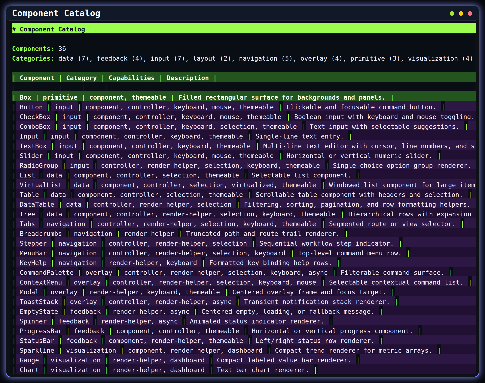
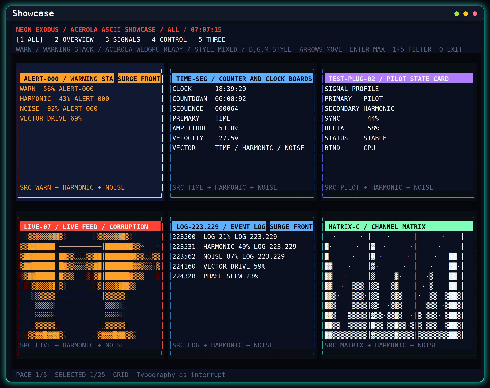
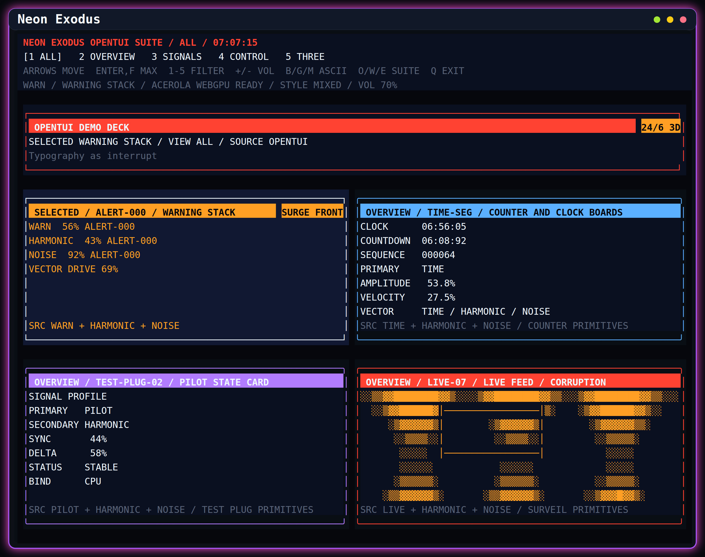
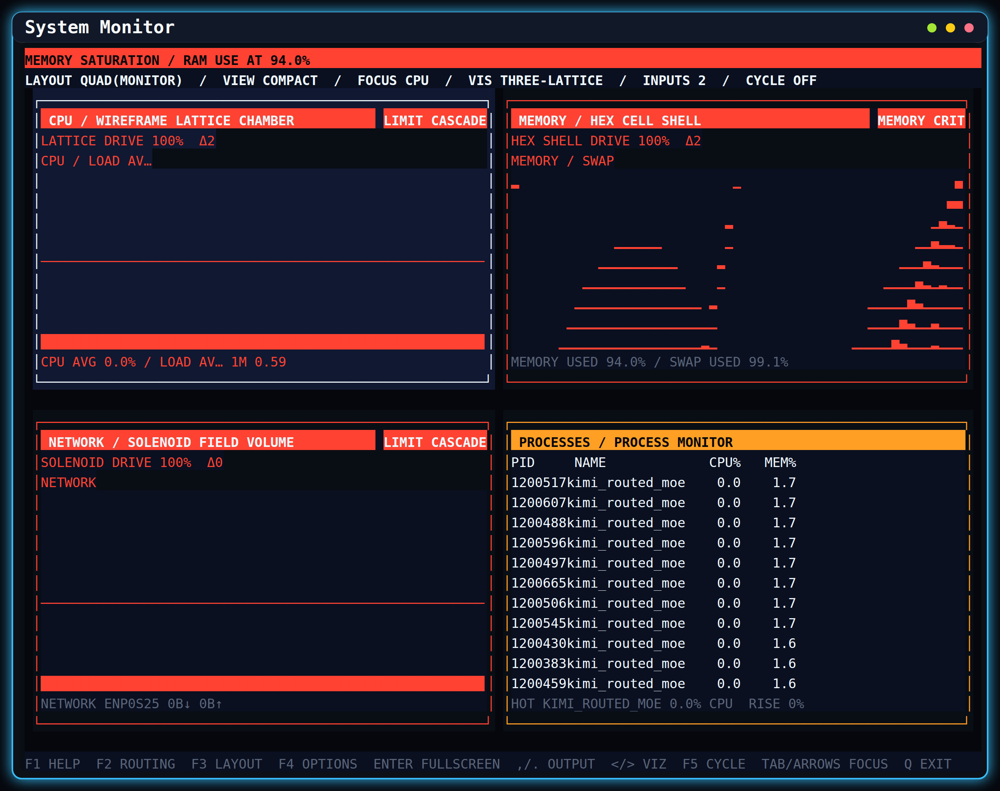

# Tui


[](https://github.com/Im-Beast/deno_tui/actions/workflows/deno.yml)
[](https://doc.deno.land/https://deno.land/x/tui/mod.ts)

A reactive, composable, Deno-first toolkit for terminal user interfaces. This fork includes the original canvas and
component foundation plus controller-first widgets, app and runtime primitives, browser and remote-terminal entrypoints,
an optional Three.js ASCII renderer, and full-screen visualization demos.

## Quick Start

New applications should use the focused `./app` entrypoint. Replace the placeholder package name when this fork is
published:

```ts
import { crayon } from "https://deno.land/x/crayon@3.3.3/mod.ts";
import { Button, Computed, createTerminalApp, Signal } from "jsr:@scope/package/app";

const count = new Signal(0);
const app = createTerminalApp<{ type: "increment" }>({
  tuiOptions: { style: crayon.bgBlack },
  commands: [{
    id: "increment",
    label: "Increment",
    binding: { key: "return" },
    action: { type: "increment" },
  }],
  onAction: () => count.value += 1,
  setup(app) {
    const button = new Button({
      parent: app.tui,
      rectangle: new Computed(() => ({
        column: Math.max(1, Math.floor(app.tui.rectangle.value.width / 2) - 9),
        row: Math.max(1, Math.floor(app.tui.rectangle.value.height / 2) - 1),
        height: 3,
        width: 18,
      })),
      label: { text: new Computed(() => `Count: ${count.value}`) },
      theme: {
        base: crayon.bgBlue,
        focused: crayon.bgLightBlue,
        active: crayon.bgCyan,
      },
      zIndex: 1,
      onPress: () => void app.executeCommand("increment"),
    });
    app.registerComponent(button);
    app.focus.focus(button);
  },
});

app.start();
```

`TerminalApp` owns input, command bindings, focus traversal, mouse routing, bracketed paste, terminal signals, and
cleanup by default. Every binding can be disabled for embedding or tests. From a repository checkout, run the focused
example, component demo, or launcher:

```sh
deno task terminal-app
deno task demo
./visualization
```

## Repository Scope

| Area                         | Primary ownership                                                                        |
| ---------------------------- | ---------------------------------------------------------------------------------------- |
| Terminal foundation          | `src/tui.ts`, `src/canvas/`, `src/component.ts`, `src/view.ts`                           |
| Input and interaction        | `src/input_reader/`, `src/input.ts`, `src/focus.ts`, `src/keymap.ts`, `src/selection.ts` |
| Widgets and controllers      | `src/components/`                                                                        |
| Layout and markup            | `src/layout/`, `src/markup/`                                                             |
| App architecture             | `src/app/`                                                                               |
| Runtime and concurrency      | `src/runtime/`                                                                           |
| Theme system                 | `src/theme*.ts`                                                                          |
| Three.js ASCII renderer      | `src/three_ascii/`                                                                       |
| Full-screen applications     | `app/`                                                                                   |
| Focused examples and tooling | `examples/`, `scripts/`                                                                  |

The package is intentionally layered. Core terminal APIs remain Deno-first. Three.js, Yoga, browser build tooling, and
screenshot tooling stay behind their owning entrypoints or tasks.

## Package Entrypoints

The export map in `deno.jsonc` defines the supported package boundaries:

| Import target   | Source                       | Runtime  | Stability    |
| --------------- | ---------------------------- | -------- | ------------ |
| `.`             | `mod.ts`                     | terminal | stable       |
| `./app`         | `mod.app.ts`                 | terminal | beta         |
| `./web`         | `mod.web.ts`                 | browser  | beta         |
| `./remote`      | `mod.remote.ts`              | remote   | experimental |
| `./three-ascii` | `mod.three_ascii.ts`         | shared   | experimental |
| `./theme`       | `mod.theme.ts`               | shared   | beta         |
| `./runtime`     | `mod.runtime.ts`             | shared   | beta         |
| `./terminal`    | `mod.terminal.ts`            | terminal | beta         |
| `./testing`     | `mod.testing.ts`             | shared   | beta         |
| `./layout/yoga` | `src/layout/solvers/yoga.ts` | shared   | experimental |

Use `./app` for new terminal applications and the root entrypoint for compatibility or low-level composition. Focused
entrypoints let application and tooling authors avoid taking a dependency on the broad terminal surface. Package
stability policy and release checks are documented in
[API Stability and Packaging](./docs/api-stability-and-packaging.md).

## Documentation

- [Repository Overview](./docs/repo-overview.md) maps module families, integration surfaces, demos, and quality gates.
- [API Reference](./docs/api-reference.md) is generated from the public re-export graph and lists every exported symbol.
- [API Stability and Packaging](./docs/api-stability-and-packaging.md) defines entrypoint tiers and release policy.
- [Testing and Performance](./docs/testing-and-performance.md) covers test helpers, benchmarks, probes, and contributor
  gates.
- [Visualization App](./docs/visualization-app.md) documents the system monitor shell and visualization controls.
- [HTML/CSS-Style Layout](./docs/html-css-layout.md) documents markup parsing, the supported CSS subset, and the simple
  and optional Yoga solvers.
- [Terminal Emulation Strategy](./docs/terminal-emulation-strategy.md) describes process, PTY, screen, and scrollback
  scope.
- [Curses and WebTUI Parity](./docs/curses-webtui-parity.md) records terminal and browser toolkit expectations.
- [Browser Framework Plan](./docs/web-framework-plan.md) explains the browser host, DOM target, remote bridge, and Pages
  build direction.

Use the generated and queryable catalogs instead of maintaining parallel symbol lists:

```sh
deno task api-inventory
deno task component-catalog
deno task app-plugin-catalog
deno task benchmark -- --list
./visualization --list
```

## Architecture

The main design rule is separation between state, projection, and host rendering:

- `Signal`, `Computed`, `Effect`, and their lazy variants own reactive state propagation.
- `Canvas`, draw objects, and sinks own terminal-cell rendering and repaint behavior.
- Widget controllers own reusable interaction state; components own terminal presentation.
- Command adapters expose controller operations to menus, palettes, keymaps, and plugins.
- `TuiApp` composes actions, routes, commands, focus, settings, history, and disposable plugins.
- Runtime plans select workers, storage, renderers, and terminal capabilities outside deterministic components.
- Terminal and browser workbenches share renderer-neutral controller, geometry, menu, workspace, and projection code.

### Component Families

| Family        | Representative APIs                                                                        |
| ------------- | ------------------------------------------------------------------------------------------ |
| Foundation    | `Box`, `Frame`, `Label`, `Text`, `View`                                                    |
| Input         | `Button`, `CheckBox`, `ComboBox`, `Input`, `TextBox`, `RadioGroup`, `Slider`               |
| Navigation    | `List`, `VirtualList`, `Tabs`, `MenuBar`, `Tree`, `FileExplorer`, `Breadcrumbs`, `Stepper` |
| Data and text | `Table`, `DataTableController`, `Pad`, `ScrollArea`, `LogViewer`                           |
| Feedback      | `ProgressBar`, `Spinner`, `EmptyState`, `StatusBar`, `ToastStack`                          |
| Overlays      | `Modal`, `ContextMenu`, `CommandPalette`, `KeyHelp`                                        |
| Dashboard     | `Sparkline`, `Gauge`, `Chart`, `MetricSeriesController`                                    |
| Visualization | `ThreeAscii`, system monitor panels, Neon Three scenes                                     |

`deno task component-catalog` is the authoritative component inventory. It supports text and JSON output and includes
category, capability, controller, and Three.js metadata.

Controllers can be used without mounting a component. Their command adapters preserve the same behavior across command
palettes, menus, key bindings, and tests:

```ts
import { bindSliderCommands, CommandRegistry, type SliderCommandAction, SliderController } from "./mod.ts";

const slider = new SliderController({
  min: 0,
  max: 100,
  step: 5,
  value: 40,
  orientation: "horizontal",
});

const commands = new CommandRegistry<SliderCommandAction>();
const dispose = bindSliderCommands(commands, slider, {
  id: "volume",
  idPrefix: "settings.volume",
  includeValueCommands: true,
  values: [0, 50, 100],
});

await commands.execute("settings.volume.increment", console.log);
dispose();
slider.dispose();
```

### Layout

`GridLayout`, `HorizontalLayout`, and `VerticalLayout` cover declarative terminal grids. `flexRects()`, split panes,
responsive recipes, and `WindowManagerController` support application shells and tiled workspaces. The markup path adds
an HTML/CSS-style tree with terminal-cell media queries, Flexbox, Grid, absolute positioning, overflow inspection, and
an optional Yoga backend.

See [HTML/CSS-Style Layout](./docs/html-css-layout.md), `examples/layout_recipe_report.ts`,
`examples/html_css_layout.ts`, and `examples/window_manager_demo.ts` for executable examples.

### App And Runtime

`createApp()` assembles the terminal host with an `ActionBus`, `RouteManager`, `CommandRegistry`, focus manager, keymap,
and lifecycle disposal. Settings bindings, undo/redo history, command surfaces, and plugin helpers build on those owners
instead of introducing app-local state loops.

`createTerminalApp()` is the recommended application boundary. It accepts routes, commands, key bindings, focus items,
mouse targets, plugins, middleware, action handling, and component setup in one definition, then owns the standard
terminal interaction and shutdown wiring. `registerComponent()` connects an interactive component to app focus and
pointer routing without legacy global control handlers.

The runtime layer provides capability and terminal plans, `AsyncScheduler`, `WorkerPool`, `RenderLoop`, memory and
IndexedDB stores, persistent signals, async resources, cached pipelines, data queries, process sessions, PTY backend
selection, and workload telemetry. Optional capabilities are selected through explicit plans and diagnostics so
components remain deterministic.

Start with these focused examples:

| Workflow                               | Example or task                                          |
| -------------------------------------- | -------------------------------------------------------- |
| App routes, settings, commands, themes | `deno task app-shell`                                    |
| Forms and widget bindings              | `deno task form-workflow`                                |
| Data table sorting and selection       | `deno task table-selection`                              |
| Process and terminal commands          | `deno task terminal-command`                             |
| Worker pool and scheduler telemetry    | `deno task runtime-workloads`                            |
| Cached resources and pipelines         | `deno task cached-resource`, `deno task cached-pipeline` |
| Runtime and terminal capability report | `deno task capabilities`                                 |

### Themes

Themes use semantic tokens and component states rather than hard-coded demo colors. Palette presets, theme packs,
provider layers, engine factories, pipelines, resolver caches, gallery previews, validation, and binding groups are
available through the root or `./theme` entrypoint.

Run `deno task theme-gallery` for the built-in palette suite and `deno task theme-workspace` for the combined provider,
factory, pipeline, and prewarm workflow.

### Browser And Remote Terminals

`mod.web.ts` exposes the Canvas2D browser host, input source, ANSI cell parsing, DOM rendering helpers, and shared app
surfaces without constructing the terminal runtime. `mod.remote.ts` exposes the transport-neutral remote terminal
protocol, browser client, and bridge to a `TerminalSessionHandle`.

Validate these boundaries with:

```sh
deno task web:check
deno task web:demo:check
deno task web:test
deno task remote:check
```

### Three.js ASCII Renderer

The optional Three.js renderer projects scenes into terminal cells using block, glyph, or mixed output. It supports
WebGPU-backed post-processing, edge and fill controls, depth color and fog, deferred readback, adaptive panel budgets,
and browser-compatible scene composition. Renderer and panel sizes follow their current terminal-cell rectangle, so
console resize updates propagate through camera aspect, render targets, and visible grid projection.

Run the standalone renderer with:

```sh
deno task three-ascii
```

The API Workbench and Neon applications exercise the renderer inside resizable, tiled, fullscreen, and minimized
windows. GPU-backed probes and visual smokes are documented in
[Testing and Performance](./docs/testing-and-performance.md).

## Demos

`./visualization` is the canonical launcher. It supports interactive search, direct aliases, and a machine-readable
catalog. Common entrypoints are:

| Command                              | Surface                                                                    |
| ------------------------------------ | -------------------------------------------------------------------------- |
| `./visualization portfolio`          | API Workbench with managed windows, controls, terminal panes, and Three.js |
| `./visualization showcase`           | Expanded widget and visualization showcase                                 |
| `./visualization neon`               | Neon Exodus-compatible and extended demo decks                             |
| `./visualization monitor`            | Live system monitor dashboard                                              |
| `./visualization polygons`           | Standalone Three.js ASCII geometry scene                                   |
| `./visualization workspace-launcher` | File-explorer-driven managed demo workspace                                |
| `./visualization gallery`            | Compact capability report                                                  |
| `./visualization health`             | Contributor health gate                                                    |

Use `./visualization --list` for every current alias and description. Use `deno task` with no task name to inspect all
direct Deno tasks from `deno.jsonc`.

## Screenshots

These fixed-size terminal captures are regenerated with `deno task screenshots`. The checked-in set is intentionally
limited to distinct interactive or catalog surfaces.

### Renderer And Workbench





### Applications And Catalog









## Development

The full contributor gate is:

```sh
deno task health
```

It verifies formatting, public API and package policy, generated docs, examples, browser and remote entrypoints,
benchmarks, the main test matrix, browser tests, and worker tests. Useful focused commands include:

```sh
deno test
deno task package-check
deno task api-inventory -- --check
deno task benchmark
deno task e2e
```

Renderer and workbench changes also require the matching live probe or PTY/browser visual smoke. See
[Testing and Performance](./docs/testing-and-performance.md) for the current matrix and thresholds.

## OS Support

| Operating system | Linux | macOS | Windows* | WSL |
| ---------------- | ----- | ----- | -------- | --- |
| Base             | yes   | yes   | yes      | yes |
| Keyboard support | yes   | yes   | yes      | yes |
| Mouse support    | yes   | yes   | yes      | yes |

On Windows, run `chcp 65001` if Unicode characters display incorrectly.

## Contributing

Open an issue or pull request for bug fixes, features, or documentation improvements. Keep changes scoped, add focused
coverage for behavior changes, and run the relevant health gates before submitting.

This project follows [Conventional Commits](https://www.conventionalcommits.org/en/v1.0.0/).

## License

MIT. See [LICENSE.md](./LICENSE.md).
